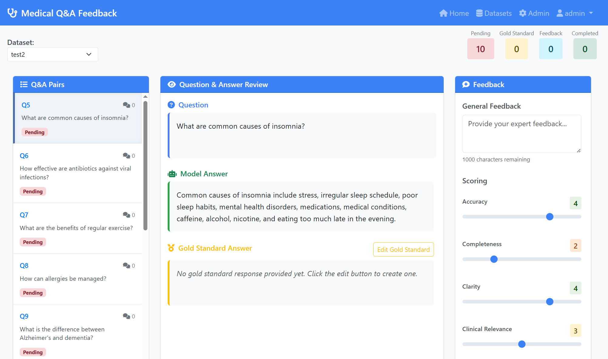

# Medical Q&A Feedback System

A web-based interface for collecting expert feedback and gold standard answers for medical question answering and RAG (Retrieval-Augmented Generation) systems.

**Demo:** [https://qa-eval-dashboard.onrender.com/](https://qa-eval-dashboard.onrender.com/)



## Features

- Review and provide feedback on medical Q&A pairs
- Score answers based on accuracy, completeness, clarity, and clinical relevance
- Provide gold standard answers for training and evaluation
- Dataset management for organizing Q&A collections
- Admin interface for user and dataset management

## Getting Started

1. Install dependencies:
   ```bash
   pip install -r requirements.txt
   ```

2. Run the application:
   ```bash
   python app.py
   ```

The application will be available at `http://localhost:5000`